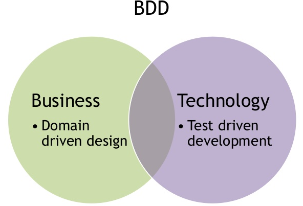
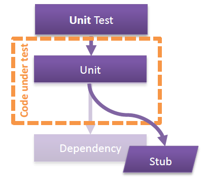

# Testing in Node.js

## How to do your testing most effective and fast?

### Equivalence Classes (Equivalence Partitioning)

Links: 

 - (RU) http://33testers.blogspot.com/2013/07/blog-post_27.html
 - (RU) http://w1zle.blogspot.com/2010/11/boundary-value-testing.html
 - (EN) http://www.ruleworks.co.uk/testguide/BS7925-2-Annex-B2.asp

### Boundary Value Analysis

Links: 

 - (RU) http://33testers.blogspot.com/2013/07/blog-post_27.html
 - (RU) http://w1zle.blogspot.com/2010/11/boundary-value-testing.html
 - (EN) http://www.ruleworks.co.uk/testguide/BS7925-2-Annex-B2.asp

### The test automation pyramid

### Definitions of test levels

#### Unit

 - These tests are written by programmers, for programmers, in the programming language of the system. 
 - The intent of these tests is to specify the system at the lowest level. 
 - Developers write these tests before writing production code as a way to specify what they are about to write. 
 - Unit tests provide as close to 100% coverage as is practical. 

#### Component 

 - Generally they are written against individual components of the system. 
 - The components of the system encapsulate the business rules, so the tests for those components are the acceptance tests for those business rules
 - Any other system components are decoupled from the test using appropriate mocking and test-doubling techniques
 - Component tests cover roughly half the system

#### Integration

 - They do not test business rules. 
 - They test how well the assembly of components communicate with each other
 - They are plumbing tests that make sure that the components are properly connected and can clearly communicate with each other
 - The tests ensure that the architectural structure of the system is sound. 
 - It is at this level that we might see performance and throughput tests.

#### System 

 - These are automated tests that execute against the entire integrated system. 
 - They are the ultimate integration tests. 
 - They do not test business rules directly. Rather, they test that the system has been wired together correctly and its parts interoperate according to plan. 
 - We would expect to see throughput and performance tests in this suite.
 - Their intent is not to ensure correct system behavior, but correct system construction.

#### Exploratory

 - These tests can be not automated
 - The intent of these tests is to explore the system for unexpected behaviors while confirming expected behaviors
 - Process of testing should have specific goal

Links:

 - (RU) Уровни Тестирования Программного Обеспечения http://www.protesting.ru/testing/testlevels.html
 - (EN) Testing Strategies in a Microservice Architecture http://martinfowler.com/articles/microservice-testing/
 - (EN) Book Robert C. Martin - The Clean Coder http://www.amazon.com/Clean-Coder-Conduct-Professional-Programmers/dp/0137081073/ref=sr_1_1?ie=UTF8&qid=1323109523&sr=8-1
 - (RU) Андрей Солнцев - Экономически эффективный процесс тестирования https://www.youtube.com/watch?v=PZq_J1AuSL0
 - (RU) Андрей Солнцев - Пацан накодил — пацан протестил! https://www.youtube.com/watch?v=8u6_hctdhqI

## Approaches

### TDD 

#### The Three Laws of TDD

 - You are not allowed to write any production code until you have first written a failing unit test.
 - You are not allowed to write more of a unit test than is sufficient to fail—and not compiling is failing.
 - You are not allowed to write more production code that is sufficient to pass the currently failing unit test.

Links:

 - (EN) Book Robert C. Martin - The Clean Coder http://www.amazon.com/Clean-Coder-Conduct-Professional-Programmers/dp/0137081073/ref=sr_1_1?ie=UTF8&qid=1323109523&sr=8-1
 - (EN) Test-Driven Development with Node.js http://www.lynda.com/Node-js-tutorials/Test-Driven-Development-Node-js/383527-2.html
 - (EN) Unit Testing and TDD in Node.js https://www.codementor.io/nodejs/tutorial/unit-testing-nodejs-tdd-mocha-sinon

### BDD

#### Specification as a ubiquitous language

Behavior-driven development borrows the concept of the `ubiquitous language` from `domain driven design`. 
A `ubiquitous language` is a (semi-)formal language that is shared by all members of a software development team — both software developers and non-technical personnel.
The language in question is both used and developed by all team members as a common means of discussing the domain of the software in question.
In this way BDD becomes a vehicle for communication between all the different roles in a software project.

Links:

 - (EN) Dan North - Introducing BDD http://dannorth.net/introducing-bdd/
 - (RU) Разработка на основе предметной области (Domain-Driven Design, DDD) https://habrahabr.ru/post/258693/
 - (EN) Eric Evans - Domain-Driven Design: Tackling Complexity in the Heart of Software http://www.amazon.com/Domain-Driven-Design-Tackling-Complexity-Software/dp/0321125215
 
 
### Mocks and Stubs

 - `Stub` have already written with predetermined behavior. 
 - `Mock` is something that as part of your test you have to setup with your expectations.

Links:

 - (EN) Martin Fowler - Mocks Aren't Stubs http://martinfowler.com/articles/mocksArentStubs.html

## Tools and libraries

   - Mocha https://mochajs.org/
   - Should https://shouldjs.github.io/
   - Chai http://chaijs.com/
   - Supertest https://www.npmjs.com/package/supertest
   - Sinon http://sinonjs.org/

## Patterns and best practices in testing

 - (EN) TDD Anti-Patterns http://blog.james-carr.org/2006/11/03/tdd-anti-patterns/
 - (RU) Анти-паттерны TDD https://habrahabr.ru/post/43761/
 - (EN) TDD Patterns and Anti-Patterns http://qabok.com/tdd-patterns-and-anti-patterns/